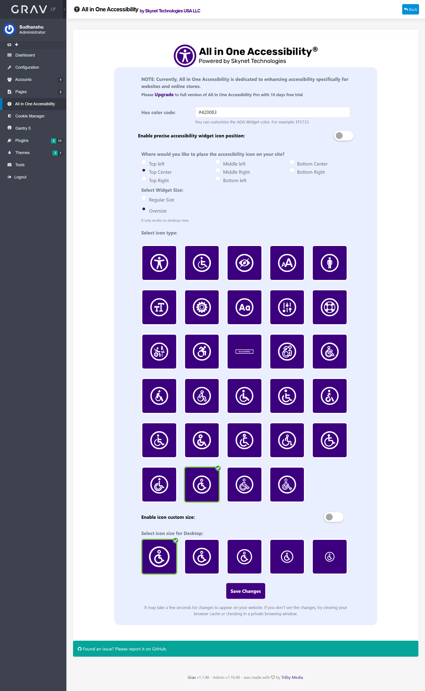
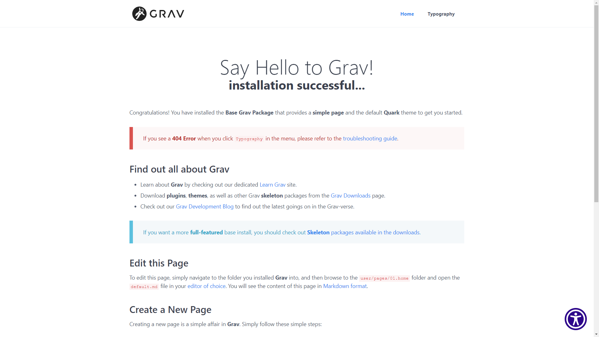

[](https://www.skynettechnologies.com)

# All in One Accessibility Plugin

The **All in One Accessibility** Plugin is an admin panel extension for [Grav CMS](http://github.com/getgrav/grav).


**Features**
- Admin All in One Accessibility to create scripts and change the color,position,icon-type,icon-size content
- All in One Accessibility to enable or disable widget via opt-in
- admin setting opt-in: yes/no means, if opt-in toggle is available for users on website accessibility widget


## Screenshot

**Admin Panel**



**Frontend**

Allinoneaccessibility and widget



## Installation

Installing the **All in One Accessibility** plugin can be done in one of three ways: The GPM (Grav Package Manager) installation method lets you quickly install the plugin with a simple terminal command, the manual method lets you do so via a zip file, and the admin method lets you do so via the Admin Plugin.

### GPM Installation (Preferred)

To install the plugin via the [GPM](http://learn.getgrav.org/advanced/grav-gpm), through your system's terminal (also called the command line), navigate to the root of your Grav-installation, and enter:

    bin/gpm install allinoneaccessibility

This will install the All in One Accessibility plugin into your `/user/plugins`-directory within Grav.
Its files can be found under `/your/site/grav/user/plugins/allinoneaccessibility`.

Its data files are saved under
`/your/site/grav/user/data/allinone-manager`.


In Plugin Settings you can change the storage folder to pages/assets.

`/your/site/grav/pages/assets/allinone-manager`.

### Manual Installation

To install the plugin manually, download the zip-version of this repository and unzip it under `/your/site/grav/user/plugins`. Then rename the folder to `allinoneaccessibility`.

You should now have all the plugin files under

    /your/site/grav/user/plugins/allinoneaccessibility

### Admin Plugin

If you use the Admin Plugin, you can install the plugin directly by browsing the `Plugins`-menu and clicking on the `Add` button.

## Configuration

```yaml
enabled: true
data_storage: pages
```

Note that if you use the Admin Plugin, a file with your configuration named allinoneaccessibility.yaml will be saved in the `user/config/plugins/`-folder once the configuration is saved in the Admin.

## Add Link to Settings in Theme

An example is a link on the website to open the widget window with the settings.

MIT License
Copyright (c) 2019 Osano, Inc., A Public Benefit Corporation
