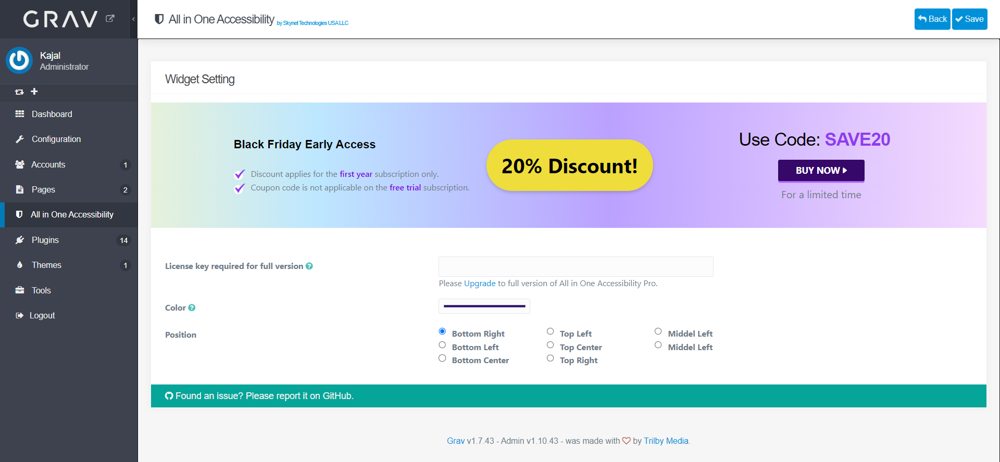

[](https://www.skynettechnologies.com)

# All in One Accessibility Plugin

## Overview

**All in One Accessibility** widget improves **Grav** website ADA compliance and browser experience for ADA, WCAG 2.1 & 2.2, Section 508, Australian DDA, European EAA EN 301 549, UK Equality Act (EA), Israeli Standard 5568, California Unruh, Ontario AODA, Canada ACA, German BITV, France RGAA, Brazilian Inclusion Law (LBI 13.146/2015), Spain UNE 139803:2012, JIS X 8341 (Japan), Italian Stanca Act and Switzerland DDA Standards.

It uses the accessibility interface which handles UI and design related adjustments. All in One Accessibility app enhances your **Grav** website accessibility to people with hearing or vision impairments, motor impaired, color blind, dyslexia, cognitive & learning impairments, seizure and epileptic, and ADHD problems.

**Features**
- 2 Minute installation
- AI widget Supports Over 65 Different Languages
- Flexible and lightweight widget that can be changed according to law.
- Reduces the risk of time-consuming accessibility lawsuits.
- Screen Reader, widget color and accessibility profiles are the top features

**Demo URL**
- https://www.skynettechnologies.com/

## Screenshot

**Admin Panel - Widget Setting**



**Frontend**

All in One Accessibility  Widget


## Installation

Installing the **All in One Accessibility** plugin can be done in one of three ways: The GPM (Grav Package Manager) installation method lets you quickly install the plugin with a simple terminal command, the manual method lets you do so via a zip file, and the admin method lets you do so via the Admin Plugin.

### GPM Installation (Preferred)

To install the plugin via the [GPM](http://learn.getgrav.org/advanced/grav-gpm), through your system's terminal (also called the command line), navigate to the root of your Grav-installation, and enter:

    bin/gpm install allinoneaccessibility

This will install the All in One Accessibility plugin into your `/user/plugins`-directory within Grav.
Its files can be found under `/your/site/grav/user/plugins/allinoneaccessibility`.

Its data files are saved under
`/your/site/grav/user/data/allinone-manager`.


In Plugin Settings you can change the storage folder to pages/assets.

`/your/site/grav/pages/assets/allinone-manager`.

### Manual Installation

To install the plugin manually, download the zip-version of this repository and unzip it under `/your/site/grav/user/plugins`. Then rename the folder to `allinoneaccessibility`.

You should now have all the plugin files under

    /your/site/grav/user/plugins/allinoneaccessibility

### Admin Plugin

If you use the Admin Plugin, you can install the plugin directly by browsing the `Plugins`-menu and clicking on the `Add` button.

## Configuration

```yaml
enabled: true
data_storage: pages
```

Note that if you use the Admin Plugin, a file with your configuration named allinoneaccessibility.yaml will be saved in the `user/config/plugins/`-folder once the configuration is saved in the Admin.

## License

The All in One Accessibility is open-sourced software licensed under the [MIT license](http://opensource.org/licenses/MIT)

